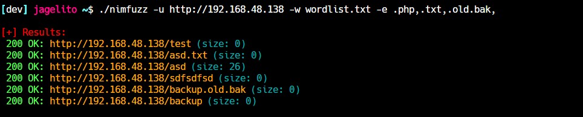

# Nimfuzz
Nimfuzzer is a simple web fuzzer. I created it simply for entertainment and to play a bit with Nim.
The project is open to new ideas and improvements, contact me if you want to contribute.
- [Compile](#compile)
- [Usage](#usage)
- [How-To-Use](#how-to-use)
- [Contact](#contact)

## Compile
At the moment I have created it for linux, but you can modify it for your own use.

Simply clone the repo, make a cd to it and run `nimble build` to create the binary

## Usage
```
Nimfuzz

Usage:
  Nimfuzz [options]

Options:
  -h, --help
  -u, --url=URL              Enter the URL target.
  -w, --wordlist=WORDLIST    Enter a wordlist.    
  -e, --extension=EXTENSION  Set extensions.      
```



## How-To-Use
- To fuzz directories and files at the same time, just add a comma `,` to the end of the `--extension` flag.

## Contact

- [Twitter](https://twitter.com/jagelit0) 
